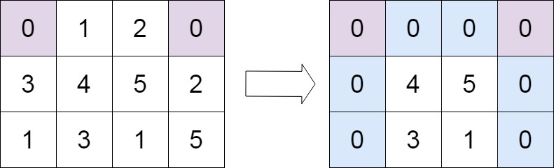

# 🔴 Set Matrix Zeroes

**Recommended Time:** 10 - 30 min

**Topics:** Branching, Loops, Functions, 1D Array, 2D Array

## Description
Given an `m x n` integer matrix, if an element is `0`, set its entire row and column to `0`.

New `0`s that are set during the process should not affect other elements in the matrix. In other words, only the original `0`s in the matrix should be used to determine which rows and columns to set to `0`.

You must modify the matrix in-place. This means **you cannot create a copy of the matrix** to perform the modifications.

## Input / Output

- **Input:** `int NUMROWS`, `int NUMCOLS`, `int matrix[][NUMCOLS]`
- **Modifies:** `matrix` in-place so that every row/column containing a `0` becomes all zeroes.

## Examples

```text
Input: 3, 3, [[1,1,1],[1,0,1],[1,1,1]]
Modified Matrix: [[1,0,1],[0,0,0],[1,0,1]]
```


```text
Input: 3, 4, [[0,1,2,0],[3,4,5,2],[1,3,1,5]]
Modified Matrix: [[0,0,0,0],[0,4,5,0],[0,3,1,0]]
```



## Hints
- It would be helpful to store which rows and columns need to be set to 0.
- I included a further useful insight (not relevant to helping you solve the problem) in my solution.

## Credits

https://leetcode.com/problems/set-matrix-zeroes/


